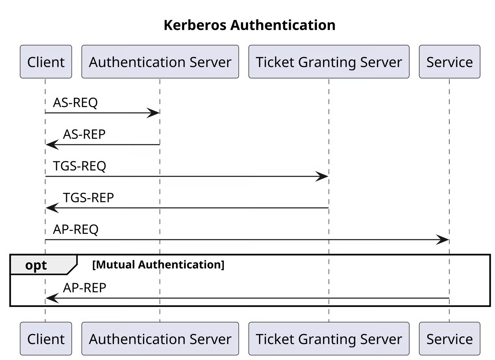

# 8️⃣ 8 - Persistence

### Topics

> 1. aa
> 2. bb
> 3. cc
> 4. dd
> 5. ee

## Ticket Forging Attacks

Remembering that the Kerberos protocol uses tickets such as TGT and TGS in its key exchange flow, the're some attacks known as forging attacks based of forging malicious tickets used to impersonate users for accessing services within the domain.

<figure><figcaption></figcaption></figure>

There're many different types of forging attacks, such as:

* [Golden Ticket Attack](2.1.md)
* [Silver Ticket Attack](2.1-1.md)
* [Diamond Ticket Attack](8.3-diamond-ticket.md)
* Sapphire Ticket Attack

They permit to obtain persistence to the system.


#### ❗ Disclaimer&#x20;

**Never use tools and techniques on real IP addresses, hosts or networks without proper     authorization!**❗


* [Golden and Silver Tickets Attacks - YT](https://www.youtube.com/watch?v=KngApymmV60)
